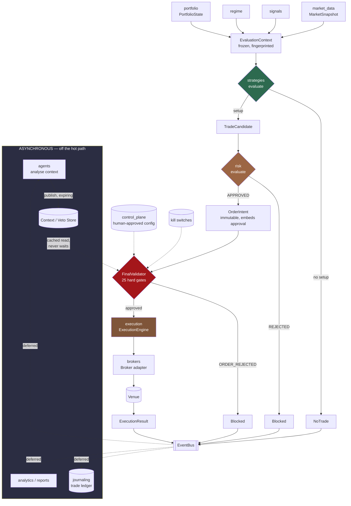

# Hybrid Trading System — Architecture

**Status:** Phase 0/1 foundation **+ architecture amendment applied.**
No live trading. No strategies. No production risk values.

> **Note on the PRD.** `docs/PRD.md` does not exist in this repository. This
> document reflects the Phase 0/1 brief as superseded by the architecture
> amendment. See blocker B-1 in `PHASE_1_STATUS.md`.

---

## 1. The one idea

**A deterministic automated trading platform that operates independently, with
agents attached as intelligence, research, auditing and veto layers.**

Not "a safer way for Claude to trade." Claude is not in the execution path, and
the platform trades without it.

| Layer | May do | May never do |
|---|---|---|
| Strategy engine | Author every trading parameter | Read the clock, network, or global state |
| Risk engine | Approve or reject a candidate | Resize, re-stop, re-target |
| Agent layer | Veto (from cache); publish context | Alter a parameter; create a trade; change mode; clear a kill switch; promote |
| Final validator | Refuse an order | Be overridden — there is no flag |
| Execution engine | Validate, translate, transmit | Compute, round or adjust anything |
| Broker adapter | Translate to a venue's dialect | Reinterpret what was asked for |
| Human | Approve the control plane and promotions | — |

Each row is enforced by types and tested. See the [ADRs](adr/).

---

## 2. Decision flow



Dotted lines are reads and deferred writes. **Nothing in the hot path waits on
anything dotted.**

A rejection, a veto and a no-trade are all **journalled outcomes**. A system that
records only its trades cannot distinguish "the strategy passed" from "the
strategy never ran".

---

## 3. The hot path

```
Market event
  → update market state
  → Strategy.evaluate()          pure, no I/O
  → Risk.evaluate()              pure, no I/O
  → context store lookup         dict read, never blocks
  → FinalValidator.validate()    25 gates, arithmetic only
  → OrderIntent                  immutable
  → Broker.submit_order()        the only network call
```

Explicitly absent: synchronous inference, GitHub calls, report generation,
database round trips, analytics, human confirmation.

Journalling, analytics and agent triggers are **deferred event handlers**, drained
outside the path. A handler that raises is logged and counted, never propagated —
a broken metrics sink must not abort a trade that already passed every risk gate.

**Risk validation is never traded away for latency.** All 25 gates run on every
order.

---

## 4. Repository layout

```
src/
├── domain/          shared kernel — value types, enums, frozen bases, fingerprints
├── control_plane/   human-approved configuration: mode, instruments, sessions,
│                    allocation, limits binding                        [NEW]
├── market_data/     MarketSnapshot, Bar, Quote, provider protocol
├── signals/         Signal, SignalSet, SignalComputer protocol   (no indicators yet)
├── regime/          MarketRegime, RegimeAssessment, classifier protocol (none yet)
├── strategies/      TradeCandidate, NoTrade, StrategyVersion, registry, promotion,
│                    determinism harness                          (no strategies)
├── risk/            RiskLimits, RiskDecision, RiskEngine          (no production values)
├── portfolio/       Position, PortfolioState (read model)
├── agents/          models.py + gate.py     — synchronous review (research only)
│                    context.py + store.py   — asynchronous context/veto  [NEW]
├── execution/       OrderIntent, ExecutionResult,
│                    validator.py  — FinalValidator                      [NEW]
│                    engine.py     — ExecutionEngine                     [NEW]
│                    killswitch.py — layered kill switches               [NEW]
├── brokers/         base.py — generic Broker interface                  [NEW]
│                    simulated/    — full simulator with failure modes   [NEW]
│                    robinhood_mcp/— read-only adapter, no capabilities
├── backtesting/     deterministic decision replay through the real components
├── journaling/      trade ledger, evidence store, import interfaces
└── observability/   JSON logging, events.py — event bus  [NEW], ops API
```

### Dependency direction

```
domain          ← everything (depends on nothing)
strategies      ← control_plane, risk, agents, execution, backtesting
control_plane   ← execution
portfolio       ← risk, execution
risk            ← execution, backtesting
agents          ← execution, backtesting
brokers         ← execution, backtesting
execution       ← backtesting
```

Dependencies flow downstream along the decision pipeline and never back. Risk
imports strategies because it judges candidates; strategies cannot import risk,
which is why a strategy cannot consult the risk engine to size itself. The graph
is acyclic and the pipeline order is legible from the imports alone.

---

## 5. Domain models

| Model | Package | Purpose |
|---|---|---|
| `MarketSnapshot` | `market_data` | The only market input a strategy may read |
| `Signal` / `SignalSet` | `signals` | Named, versioned measurements |
| `RegimeAssessment` | `regime` | Market-state context |
| `PortfolioState` / `Position` | `portfolio` | Exposure, open risk, drawdown, streaks |
| `TradeCandidate` | `strategies` | A fully specified proposal |
| `NoTrade` | `strategies` | An explicit, journalled decision not to act |
| `StrategyMetadata` / `StrategyVersion` | `strategies` | Identity and immutable revision |
| `RiskDecision` | `risk` | Binding approve/reject verdict |
| `AgentReview` | `agents` | Synchronous veto (research path) |
| `AgentContext` | `agents` | **Cached, expiring veto/context (production path)** |
| `ControlPlaneConfig` | `control_plane` | **The human-approved operating envelope** |
| `OrderIntent` | `execution` | Approved, immutable instruction to trade |
| `ExecutionResult` | `execution` | The system's record of what happened |
| `BrokerOrderRequest` / `BrokerOrder` | `brokers` | **Venue-neutral translation boundary** |
| `KillSwitch` | `execution` | **One engaged halt, with its trigger** |
| `DomainEvent` | `observability` | **One thing that happened** |
| `TradeRecord` | `journaling` | One normalized ledger event |

### Guarantees on every record

- **Frozen** — attribute assignment raises.
- **Closed** — `extra="forbid"`; nothing can be smuggled through `model_validate`.
- **Exact** — `float` is *rejected* for money and size, not coerced.
- **Aware** — naive datetimes rejected; everything normalised to UTC.
- **No hidden inputs** — no clock defaults, no `uuid4()` defaults. Ids are
  derived, which is what makes replay exact.

### Fingerprint chain

```
MarketSnapshot ─┐
SignalSet ──────┼─→ EvaluationContext.fingerprint()
RegimeAssessment┘         │
                          ↓ recorded as inputs_fingerprint
              TradeCandidate.authoritative_fingerprint()
                          │
      ┌───────────────────┼────────────────────┐
      ↓                   ↓                    ↓
 RiskDecision       AgentContext         OrderIntent
 .candidate_        (scoped, not         .candidate_fingerprint
  fingerprint        bound)              .idempotency_key = sha256(fp)
                                         .configuration_hash → ControlPlaneConfig
```

Downstream layers bind to the fingerprint, which turns "please don't swap the
candidate after approval" from a rule into a caught error.

**The idempotency key derives from the authoritative fingerprint alone** —
deliberately *not* from the configuration hash or creation time. A retry after a
timeout must reach the venue as the same logical order; a key that shifted when
an unrelated setting changed would turn one order into two.

### Field naming

The amendment's `direction` and `asset_type` are this codebase's `side` and
`asset_class`. The names were kept because the risk engine, portfolio and ledger
already use them and renaming across 30 files buys nothing; the semantics are
identical. Every other field the amendment names exists: `order_id`
(`order_intent_id`), `decision_id`, `risk_amount`, `configuration_hash`,
`market_snapshot_hash`.

---

## 6. Boundary enforcement, concretely

**Agent cannot alter a trade** — `AgentReview` and `AgentContext` both declare
no trading-parameter fields; the forbidden set is derived from
`TradeCandidate.AUTHORITATIVE_FIELDS`, so new parameters are covered
automatically; import-time assertions fail the package if that is violated. The
only candidate fields a context may name are `symbol` and `strategy_id`, which
are *addressing* — they narrow what a veto covers and cannot widen anything.

**Agent cannot delay a trade** — the store is a dict read. `resolve_agent_gate`
takes `now` as an argument and performs no I/O.

**Risk cannot be bypassed** — `OrderIntent` embeds the `RiskDecision` rather than
its id; `assert_authorized` checks verdict, coherence, candidate id and
fingerprint at both construction and submission.

**The validator cannot be overridden** — no `force`, no `skip_checks`, no partial
run. Asserted structurally by inspecting the signature, not left to convention.

**Live trading is unbuilt** — `apply_configuration_change` refuses
`ExecutionMode.LIVE`; the Robinhood adapter declares no capabilities, so the
engine refuses it before an order is even built.

**No production risk values** — every `RiskLimits` field is required with no
default.

---

## 7. Execution modes and the stage ladder

| Mode | Reaches venue | Requires strategy stage ≥ |
|---|---|---|
| `DISABLED` | no | — |
| `SHADOW` | no (validates fully) | `SHADOW` |
| `PAPER` | paper endpoint | `PAPER` |
| `LIMITED_LIVE` | real money | `LIMITED_LIVE` |
| `LIVE` | — | reserved, unimplemented |

```
DEVELOPMENT → BACKTEST → OUT_OF_SAMPLE → WALK_FORWARD → SHADOW ═══► PAPER ═══► LIMITED_LIVE
└─────────── automated pipeline may drive ───────────┘        ▲              ▲
                                                    human approval   human approval
```

Mode and stage must **both** permit the trade. Two independent controls agree
before an order leaves the building.

**SHADOW is a real path**, not a dry run: every gate executes, only the broker
call is skipped. A shadow run that would have been rejected is recorded as
rejected — which is what makes shadow evidence worth anything.

---

## 8. Failure handling

| Failure | Response |
|---|---|
| Broker timeout | Record `UNKNOWN`, engage strategy kill switch, **do not retry**. Reconcile. |
| Broker unavailable | Nothing sent; release the key; engage broker kill switch |
| Broker rejection | Terminal; record and stop |
| Duplicate submission | `DuplicateOrderError` — reconcile, don't resubmit |
| Partial fill | Reported as `PARTIALLY_FILLED` with the actual quantity |
| Stale data | Gate rejects before submission |
| Agent down | Behaviour per configured `AgentContextPolicy` |
| Handler exception | Logged and counted; never propagates |

**A timeout is not a failure.** The order may be working. Retrying is how one
intended position becomes two.

### Kill switches: easy to engage, hard to clear

Five scopes: `SYSTEM`, `STRATEGY`, `SYMBOL`, `BROKER`, `ACCOUNT`.

Only `BROKER_UNAVAILABLE` and `STALE_MARKET_DATA` may be cleared automatically —
both describe a transient infrastructure condition that is directly observable.
Every other trigger describes a risk event, and a risk event that resolves itself
without anyone looking is exactly what this mechanism exists to prevent.

---

## 9. Deliberate non-choices

- **No microservices.** One repository, one process, in-process calls. Network
  boundaries between a strategy and its risk check add failure modes and buy
  nothing at this scale.
- **No message broker.** The event bus is in-process, with an explicit
  immediate/deferred split so observability cannot lengthen the hot path.
- **No async/await.** The hot path is arithmetic and one network call.
- **No P&L backtest.** Decision replay only. Fill and slippage modelling needs
  assumptions nobody has agreed; a number that looks like a return but isn't is
  worse than no number.
- **No slippage in the simulator.** Same reason.
- **No `data/raw` deletion path.** Storage grows monotonically.

---

## 10. Where later phases plug in

| Capability | Interface | Blocked on |
|---|---|---|
| Real market data | `MarketDataProvider` | D-2 |
| Indicators | `SignalComputer` | strategy definition |
| Regime classifier | `RegimeClassifier` | D-4 |
| Actual strategies | `Strategy` + registry | **D-7** |
| Claude context publisher | writes `AgentContext` | Q-2 |
| Tradier / IBKR / Alpaca | `Broker` | D-2 |
| Historical import | `SourceImporter` | inspecting real payloads |
| Live trading | — | D-5 + ADR-008 workflow |

Every one is an interface that already exists. None requires changing the
authority model — which is the point of building it first.
