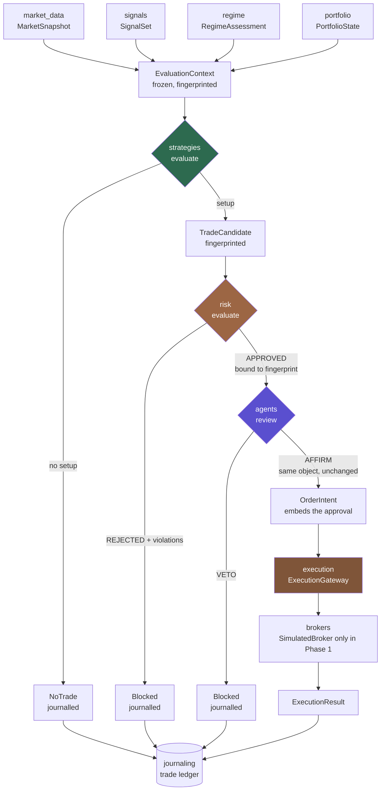

# Hybrid Trading System — Architecture

**Phase:** 0/1 foundation. No live trading, no autonomous execution, no
strategies, no production risk values.

> **Note on the PRD.** This document was written against the Phase 0/1 task
> brief. `docs/PRD.md` does not exist in this repository — see blocker B-1 in
> `PHASE_1_STATUS.md`. Where the PRD and this document disagree, the PRD wins
> and this document gets corrected.

---

## 1. The one idea

Everything below follows from a single constraint: **deterministic code decides,
AI reviews, humans promote.**

| Layer | May do | May never do |
|---|---|---|
| Strategy engine | Author every trading parameter | Read the clock, the network, or global state |
| Risk engine | Approve or reject a candidate | Resize, re-stop, re-target |
| Agent layer | Veto; attach rationale | Alter any parameter; create a trade |
| Execution layer | Transmit an approved intent | Compute, round or adjust anything |
| Human | Promote to production | — |

Each row is enforced by types and tested, not by convention. See
[ADR-001](adr/ADR-001-deterministic-trading-authority.md) and
[ADR-002](adr/ADR-002-ai-veto-only-authority.md).

---

## 2. Decision flow



A veto and a rejection are both **journalled outcomes**, not silences. A system
that records only its trades cannot distinguish "the strategy passed" from "the
strategy never ran".

---

## 3. Repository layout

```
src/
├── domain/          shared kernel — value types, enums, frozen bases, fingerprints
├── market_data/     MarketSnapshot, Bar, Quote, provider protocol
├── signals/         Signal, SignalSet, SignalComputer protocol   (no indicators yet)
├── regime/          MarketRegime, RegimeAssessment, classifier protocol (no classifier yet)
├── strategies/      TradeCandidate, NoTrade, StrategyVersion, registry, promotion,
│                    determinism harness                          (no strategies)
├── risk/            RiskLimits, RiskDecision, RiskEngine          (no production values)
├── portfolio/       Position, PortfolioState (read model)
├── execution/       OrderIntent, ExecutionResult, ExecutionGateway, SimulatedBroker
├── brokers/
│   └── robinhood_mcp/   read-only MCP adapter; submit() raises
├── agents/          AgentReview, gate, AgentReviewer protocol     (no LLM client)
├── backtesting/     deterministic decision replay                (no P&L simulation)
├── journaling/      TradeRecord, SQLAlchemy schema, evidence store, import interfaces
└── observability/   JSON logging, redaction, ops API
```

Each directory is one bounded context and one importable package.

### Dependency direction

```
domain  ←  everything (depends on nothing)
market_data ← signals, regime, strategies
portfolio   ← risk
strategies  ← risk, agents, execution, backtesting
risk        ← execution, backtesting
agents      ← execution, backtesting
execution   ← backtesting
```

Dependencies flow **downstream along the decision pipeline** and never back.
Risk imports strategies because it judges candidates; strategies cannot import
risk, which is precisely why a strategy cannot consult the risk engine to size
itself. The graph is acyclic and the pipeline order is legible from the imports
alone.

`domain/` is the only shared kernel. It holds value types, enums, the frozen
model base and fingerprinting, and imports nothing from `src/`.

---

## 4. Domain models

| Model | Package | Purpose |
|---|---|---|
| `MarketSnapshot` | `market_data` | The only market input a strategy may read |
| `Signal` / `SignalSet` | `signals` | Named, versioned measurements |
| `RegimeAssessment` | `regime` | Market-state context |
| `PortfolioState` / `Position` | `portfolio` | Current exposure (read model) |
| `TradeCandidate` | `strategies` | A fully specified proposal |
| `NoTrade` | `strategies` | An explicit, journalled decision not to act |
| `StrategyMetadata` | `strategies` | Identity of a strategy |
| `StrategyVersion` | `strategies` | Immutable, promotable revision |
| `RiskDecision` | `risk` | Binding approve/reject verdict |
| `AgentReview` | `agents` | Veto or affirm; no trading parameters |
| `OrderIntent` | `execution` | Approved, immutable instruction to trade |
| `ExecutionResult` | `execution` | What the venue reported |
| `TradeRecord` | `journaling` | One normalized ledger event |

Models live in the layer that owns them rather than in a shared `models.py`, so
an import is a statement about authority: `risk` importing `TradeCandidate` says
risk judges candidates, and the absence of the reverse import says a strategy
cannot ask risk for permission mid-decision.

### Guarantees on every record

- **Frozen.** `frozen=True`. Attribute assignment raises.
- **Closed.** `extra="forbid"`. Undeclared keys are rejected, so nothing can be
  smuggled through `model_validate`.
- **Exact.** `float` is *rejected* for money and size, not coerced —
  `Decimal(0.1)` is not `Decimal("0.1")`, and a fingerprint over a widened float
  is not reproducible.
- **Aware.** Naive datetimes are rejected; everything is normalised to UTC.
- **No hidden inputs.** No `default_factory=datetime.now`, no `uuid4()` default.
  Timestamps and ids are supplied or derived, which is what makes replay exact.

### Fingerprinting

`AuthoritativeModel.authoritative_fingerprint()` is a SHA-256 over the fields
that determine *what the market would feel*, canonicalised so `Decimal("1.50")`
and `Decimal("1.5")` hash identically. Commentary, review ids and audit
timestamps are excluded — rewording a rationale must not change the trade.

Downstream layers bind to the fingerprint, which turns "please don't swap the
candidate after approval" from a rule into a caught error.

---

## 5. Boundary enforcement, concretely

**Agent cannot alter a trade** — `AgentReview` declares no trading parameter
fields; `FORBIDDEN_REVIEW_FIELDS` is derived from
`TradeCandidate.AUTHORITATIVE_FIELDS` so new parameters are covered
automatically; an import-time assertion fails the package if that is ever
violated; `apply_reviews` returns the candidate *by identity*.

**Risk cannot be bypassed** — `OrderIntent` embeds the `RiskDecision` rather than
its id, and `assert_authorized` checks verdict, coherence, candidate id and
fingerprint at both construction and submission. `ExecutionGateway.submit`
rejects anything that is not an `OrderIntent`.

**Live trading is unbuilt** — `ExecutionMode.LIVE` raises at gateway
construction; `RobinhoodMCPAdapter.submit` raises; the MCP adapter's tool
allowlist is read-only, so a new mutating tool upstream cannot silently widen
what the system can do.

**No production risk values** — every `RiskLimits` field is required with no
default. A limit set cannot be half-specified or inherit a number nobody chose.

---

## 6. Data and the ledger

```
data/raw/          immutable, content-addressed source evidence (ADR-003)
data/normalized/   regenerable derived output (git-ignored)
data/fixtures/     small, clearly-fake test inputs
```

The ledger normalizes five sources into **one** `TradeRecord` shape:

| Source | Event type |
|---|---|
| Claude recommendations | `RECOMMENDATION` |
| Robinhood orders | `ORDER` |
| Robinhood fills | `FILL` |
| MCP tool calls | `TOOL_CALL` |
| This system's own decisions | `STRATEGY_DECISION` |

Five bespoke tables would each need their own queries and migrations, and
answering "what happened to this idea between recommendation and fill" would
mean stitching them together by hand. One shape, with source-specific fields
preserved verbatim in a JSONB `payload` that nothing authoritative ever reads.

Tables: `raw_documents` (evidence pointers), `ingestion_runs` (one row per
import attempt, so a partial failure is visible), `trade_records` (the ledger).
Imports are idempotent on `fingerprint`, so re-running after a partial failure
is safe. Externally-sourced rows are *required* to carry a
`raw_document_sha256`.

**Import interfaces exist; parsers do not.** Writing a parser against a format
nobody has inspected produces code that is confidently wrong — it mis-reads a
column, and the error surfaces months later as a ledger that disagrees with the
brokerage. Each placeholder importer records the specific questions a human must
answer first (see `journaling/importers/placeholders.py`).

---

## 7. Observability

Structured JSON, one object per line, because an incident review means
correlating a decision, a verdict and a broker response milliseconds apart, and
grep over prose does not do that. `correlation_scope()` propagates an id across
modules via contextvars. Sensitive field names are redacted as a backstop; DSNs
are redacted separately in `journaling.database`.

The FastAPI surface is `/healthz`, `/readyz`, `/capabilities` — **and nothing
else**. `/capabilities` reports `live_trading_enabled: false` so an operator can
verify from outside that a running instance cannot trade. A test asserts the
route list contains no fourth endpoint.

---

## 8. Deliberate non-choices

- **No microservices.** One repository, one process, in-process function calls.
  Network boundaries between a strategy and its risk check add failure modes and
  buy nothing at this scale.
- **No message broker, no async, no cache.** Nothing here is latency-bound.
- **No P&L backtest.** Decision replay only. Fill and slippage modelling needs
  assumptions nobody has agreed; a number that looks like a return but isn't is
  worse than no number.
- **No ORM-level business logic.** SQLAlchemy stores rows; Pydantic validates
  domain records; the mapping between them lives in exactly one place.
- **No `data/raw` deletion path.** Storage grows monotonically. Revisit only at
  a scale we are nowhere near.

---

## 9. Where later phases plug in

| Capability | Plugs into | Blocked on |
|---|---|---|
| Real market data | `MarketDataProvider` | vendor choice (D-2) |
| Indicators | `SignalComputer` | strategy definition |
| Regime classifier | `RegimeClassifier` | human definition of the boundaries (D-4) |
| Actual strategies | `Strategy` + registry | out of Phase 0/1 scope |
| LLM reviewer | `AgentReviewer` | prompt/model choice (Q-2) |
| Historical import | `SourceImporter` | inspecting real payloads |
| Paper trading | `BrokerAdapter` | D-5 |
| Live trading | — | D-5 + full ADR-005 workflow |

Every one is an interface that already exists. None requires changing the
authority model — which is the point of building it first.
